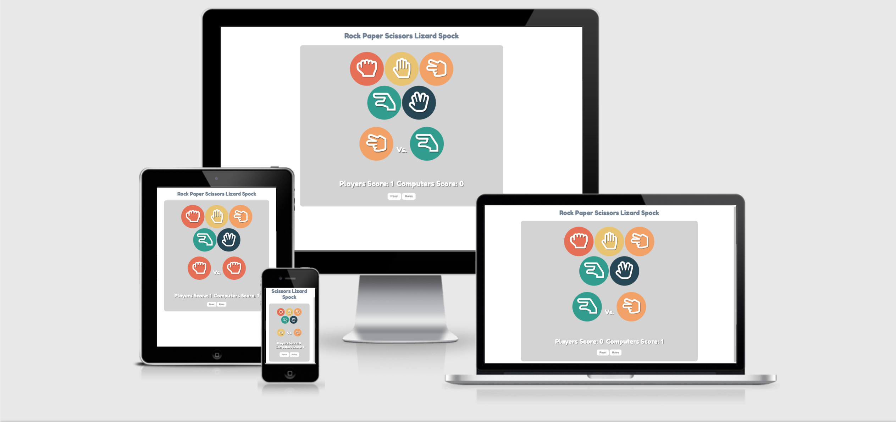

# Rock Paper Scissors Lizard Spock

This is a javascript mini game. The main purpose for this game is to be fun and interactive. Its aimed to be played when the user has a spare few minutes in their day, whether on a study break or just looking for something to do. This game allows the user to play against the computer, with a risk and reward outcome. The risk being that the user choses an option that they think might beat their opponent, in this case versing the computer. The reward is that their score increases when they beat the computer, until they reset the game. 

## Planning

In this section it shows the basic structure of what was planned for the game. The software that was used was balsamiq wireframes. As you can see in the screen shots provided it shows the different areas of the game from what the player can chose, to showing the results of what they picked verses the computer and also the score to see how many points they have verses the computers score. 

There is also a rough draft about the user stories to help with building the game, about what the user might want to do whilst interacting with the game.

Here shows a screen shot of text boxes explaining how the game is divided into seperate sections and links to websites with a colour pallete and rules to the game.

## Features

__Main Title__

* At the top of the page you can find the main title, which explains to the player what the mini game is called.

__Player Choice Area__

* This section is for the player to select which option they would like to use to verse the computer.

__Results Area__

* The section shows the outcome of the match, from players choice to the left and computers choice to the right.

__Scoring Area__

* This section shows how many points the player has and also how many points the computer has.

__Reset Button__

* This is a button to allow the player to reset the game so that the scores will show 0.