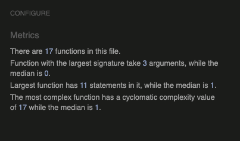

# Rock Paper Scissors Lizard Spock

This is a javascript mini game. The main purpose for this game is to be fun and interactive. Its aimed to be played when the user has a spare few minutes in their day, whether on a study break or just looking for something to do. This game allows the user to play against the computer, with a risk and reward outcome. The risk being that the user choses an option that they think might beat their opponent, in this case versing the computer. The reward is that their score increases when they beat the computer, until they reset the game. 

## Planning

* In this section it shows the basic structure of what was planned for the game. The software that was used was balsamiq wireframes. As you can see in the screen shots provided it shows the different areas of the game from what the player can chose, to showing the results of what they picked verses the computer and also the score to see how many points they have verses the computers score. 

* There is also a rough draft about the user stories to help with building the game, about what the user might want to do whilst interacting with the game.

* Here shows a screen shot of text boxes explaining how the game is divided into seperate sections and links to websites with a colour pallete and rules to the game.

## Features

__Main Title__

* At the top of the page you can find the main title, which explains to the player what the mini game is called.

__Player Choice Area__

* This section is for the player to select which option they would like to use to verse the computer.

__Results Area__

* The section shows the outcome of the match, from players choice to the left and computers choice to the right.

__Scoring Area__

* This section shows how many points the player has and also how many points the computer has.

__Reset and Rules Buttons__

* The reset button allows the player to reset the game so that the scores will show 0. 

* The rules button allows the player to access the rules.

* The rules shows up in a pop up modal that shows the player which hand signal defeats the other.

## Testing

__Browser Testing__

This subsection shows all the screenshots of the game being tested on different browsers, either through computer or mobile devices.

* Game view on Google Chrome, on an ultra wide 32 inch monitor.

* Game view on Mozilla FireFox, using a 13 inch Macbook Pro.

* Game view on Safari using a 13 inch Macbook Pro. Noticing that it doesnt fit full screen and that the game design does not seem responive.

* Game view on an iPad using DuckDuckGo web-engine, which uses a parent engine of Mozilla FireFox.

* Game view on an iPhone 6 using the Safari search engine.

* Game view on a Google Pixel 4a using the search engine Google Chrome.

__Validator Testing__

HTML using the official [W3C Validator](https://validator.w3.org/nu/?doc=https%3A%2F%2Fmbissett29.github.io%2Frock-paper-scissors-lizard-spock%2F)

* No errors were shown when passing through validator, just three warning messages. These messages suggest to use heading elements for the different sections however the sections are used to style the different parts of the game.

CSS using the official [(Jigsaw) Validator](https://jigsaw.w3.org/css-validator/validator?uri=https%3A%2F%2Fmbissett29.github.io%2Frock-paper-scissors-lizard-spock%2F&profile=css3svg&usermedium=all&warning=1&vextwarning=&lang=en)

* No errors were found.

JavaScript using the official [Jshint validator](https://jshint.com/)

* No errors found, however 14 warnings were shown. Showing that the JS extensions didnt support the temperate literals, and calling the glabal variables by Let and Const. 

## Deployment

* This site was delpoyed through GitHub pages through the following steps:
    * First in the GitHub repository you need to find the settings tab.
    * Second from the souce section drop down the menu to select the master branch.
    *Then finally once selected, the whole page will be refreshed showing the live link at the top.

* This is the link to the live website: https://mbissett29.github.io/rock-paper-scissors-lizard-spock/

## Credits

__Content__

* The font style for this game was taken from [Google Fonts.](https://fonts.google.com/specimen/Fredoka+One?query=fredo#license)

* The color pallete that was used was from [Coolors.co.](https://coolors.co/264653-2a9d8f-e9c46a-f4a261-e76f51)

* The rules in the modal were taken from [The Big Bang Theory Fandom Page.](https://bigbangtheory.fandom.com/wiki/Rock,_Paper,_Scissors,_Lizard,_Spock)

* The icons used for the buttons were taken from [Font Awesome.](https://www.fontawesome.com/)

* How to implement the Modal was taken from [W3 Schools.](https://www.w3schools.com/howto/howto_css_modals.asp)

